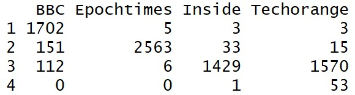

# NTU_CSX_DataScience

## Homework
Keywords from different media of Elon Musk
* Shiny.io: https://louiechen.shinyapps.io/Trial/
* However, the deployed Shiny.io can't read my data which is uploaded within the same file. The Shiny can only run on my computer, so I will demo it on class. Will try my best to figure out the reason by the end of this semester.
* HTML: https://louiechen16.github.io/NTU_CSX_DataScience/Week_7/HW/Trial/Keywords_for_Elon_Musk.html

## Problem Overview
### Purpose
Already known by most people that press usually report political issues and news with their point of view. So I am curious that whether press will do the same thing when they report business news. If so, it will be quite dangerous for us to only watch reports from single media because we might have similar point of view with that media when we get that information. 

### Reasearch Target
Elon Musk is a well-known business man around the world, who has been reported a lot, so it will be easy to get a huge amount of reports from him. What's more, he is also very controversial. There are both positive and negative reports for him, so when we observe those reports, we can easily figure out the point of view of that media. To sum up, I think Elon Musk is a good target to take a research in this topic.

## Main Approach

### 1. Get Material
First I crawler reports from following 4 media writen in Mandarin that report Elon Musk the most.

* [Techorange](https://buzzorange.com/techorange/)
* [BBC Chinese](https://www.bbc.com/zhongwen/trad)
* [Epochtime](https://www.epochtimes.com/b5/)
* [Inside](https://www.inside.com.tw/)

I searched Elon Musk on each media and clawer first 3 pages' report content to do following steps.

### 2. Data Processing

Data Cleanning: Get rid of unwanted characters, ex: English characters, digits......
Cut Word: Cut words using jiebaR.
Word Frequence Frame: Calculate frequence of very terms and show on frame.
Hot Word Bar Chart: Show hot words on sorted bar chart.
TF-IDF Computation: Compute TF-IDF from frequence frame to do following analysis.

### 3. Machine Learning

* PCA: Use PCA to reduce dimension.
* Kmeans: Use kmeans to cluster data into 4 groups.
* Predict: Predict source of pasted article by prediction matrix.

## Key Finding

